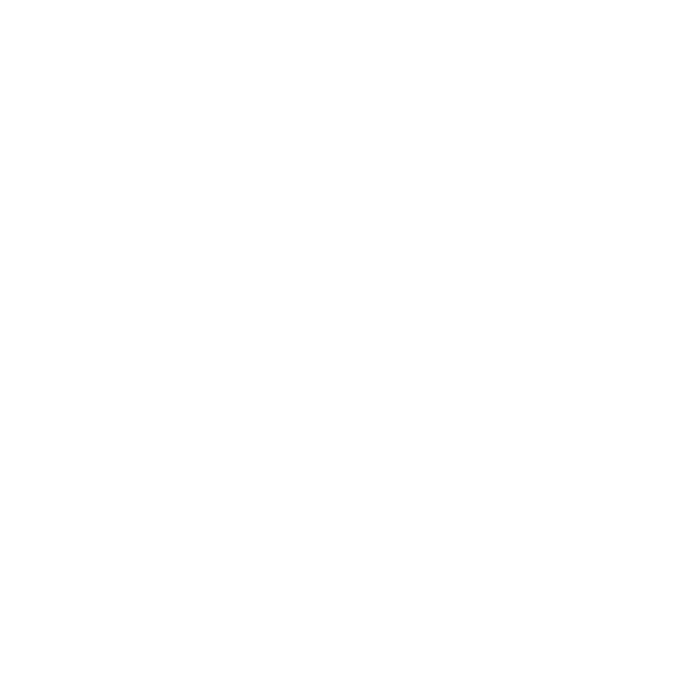

# Koustos

Turn shareable links into structured GitHub issues without requiring reporters to have GitHub accounts. Built with Next.js (Vercel), Convex, and OpenAI. Email is out of scope in MVP.



## Quick Start

### 1) Clone
```bash
git clone https://github.com/spenceriam/Koustos.git
cd Koustos
```

### 2) Install
```bash
npm install
```

### 3) Configure environment
Create environment variables in Vercel/Convex (or a local `.env` for development):
```bash
CONVEX_DEPLOYMENT=
OPENAI_API_KEY=
# RESEND_API_KEY not required in MVP
ENCRYPTION_KEY= # 32-byte hex for AES-256
NEXT_PUBLIC_URL=https://koustos.dev
# Optional if using Convex HTTP client via URL (server-side):
# CONVEX_URL= https://<deployment>.convex.cloud
```

You can copy `.env.example` to `.env` locally and fill in the values.

### 4) Run locally (when ready)
```bash
# Terminal A (Convex)
# npx convex dev

# Terminal B (Next.js)
# npm run dev
```

### Convex environment (server runtime for functions)
Set these in Convex so functions can run:
```bash
npx convex env set ENCRYPTION_KEY <64-hex>
npx convex env set OPENAI_API_KEY <openai-key>
# no email env required
npx convex env set NEXT_PUBLIC_URL https://koustos.dev
```

Generate a 32-byte hex key:
```bash
openssl rand -hex 32
# or
node -e "console.log(require('crypto').randomBytes(32).toString('hex'))"
```

### Notes
- No emojis in UI, emails, or issue titles/bodies.
- Public GitHub repos only; English-only AI prompts.
- Rate limit: 10 reports/hour per project (server-side in Convex).

## How to Use

1. Visit `/setup` and provide:
   - GitHub Personal Access Token (public_repo scope)
   - Repository in `owner/repo` format
   - Maintainer email
2. After setup, copy the generated URL `koustos.dev/f/{slug}` and share it.
3. Reporters open the URL, submit a description, and answer exactly two AI follow-up questions.
4. The system formats the report, creates a GitHub issue, and emails both the maintainer and the reporter (no emojis).

## Tech
- Database: Convex (encrypted PAT at rest)
- Hosting: Vercel (Next.js 14)
- AI: OpenAI via official SDK
- Email: not implemented in MVP
- GitHub: REST API v3

## Notes
- Rate limit: 10 reports/hour per project (enforced in Convex)
- English-only; public repositories
- See `AGENTS.md` and `docs/` for architecture, flows, and guardrails
