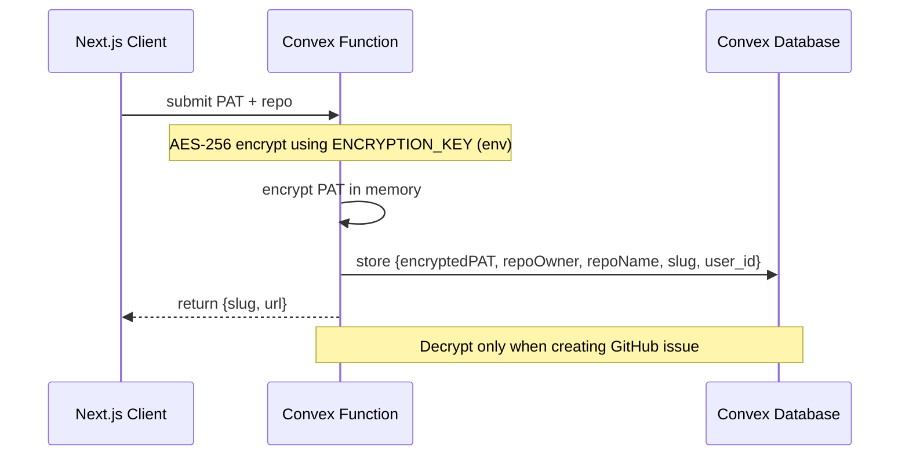

# Koustos MVP – Technical Design Document (TDD)

## 1. Executive Summary
Koustos is a lightweight, serverless micro-service that turns a one-time GitHub-PAT + repo configuration into a public, rate-limited bug-report portal.  
The system is optimized for sub-30-second setup, sub-2-minute reporter flow, and <$0.001 marginal cost per report.

## 2. High-Level Architecture
```mermaid
graph TD
    subgraph Client
        A[Next.js 14 (Vercel)<br/>koustos.dev]
    end
    subgraph Vercel
        B[Vercel Edge/SSR]
    end
    subgraph Convex
        C[Convex Functions<br/>setup / report / ai / finalize / auth]
        G[(Convex Database:<br/>Better Auth tables + Projects, ShareableUrls, Reports)]
        H[(Secrets/Env: ENCRYPTION_KEY, BETTER_AUTH_SECRET, OAuth creds)]
    end
    subgraph External
        J[GitHub REST v3]
        K[OpenAI API]
        L[Resend API]
    end

    A <--> B
    B <--> C
    C --> K
    C --> J
    %% Email removed in MVP
    %% C --> L
    C --> G
    G -.-> H
```

## 3. Component Specification

### 3.1 Front-End (Next.js 14 + TypeScript)
- Hosted on Vercel (Preview → Prod via GitHub integration).
- No client-side secrets; calls Convex functions for server actions.
- Styling: TailwindCSS, no emoji font.
- Accessibility: WCAG 2.1 AA.
- Shared components: `ReportForm`, `IssuePreview`, `CopyUrl`, Toast provider for UI states.
- Better Auth client SDK hydrates session context via `AuthProvider`.
- Setup wizard focuses on PAT + repo; email not collected in MVP.

### 3.2 Auth & Convex Functions
- `authComponent` (Better Auth) exposes session-aware helpers and database adapters.
- `createAuth(ctx)` configures Better Auth with magic link and social providers.
- `authComponent.registerRoutes` mounts HTTP handlers in `convex/http.ts` with CORS enabled.

### 3.3 Core Convex Functions
- `setup.createProject(pat, repo)` → validate PAT via GitHub API, encrypt PAT, store project under `user_id`, return slug/url.
- `report.start(slug, name, description)` → create report, enforce rate limit, return first AI question.
- `ai.respond(reportId, answer)` → drive conversation; stop after 2 follow-ups.
- `finalize.submit(reportId, edits?)` → decrypt PAT, create GitHub issue. (Emails removed in MVP)

Rate limit enforced in Convex using per-slug counters (10 reports/hour).

### 3.4 Integrations
- OpenAI via official SDK from Convex functions (system prompt enforces 2 Qs, English-only, no emojis).
- GitHub REST v3 for issue creation (Authorization: token `PAT`).
- Email sending removed in MVP; magic links disabled.
- Better Auth handles magic link and OAuth flows; Convex stores encrypted PATs keyed by Better Auth user.

## 4. Data Model (Convex)

```javascript
// Better Auth tables (user/session/account/...) + custom application tables
authTables: { /* imported from @convex-dev/better-auth */ }

projects: {
  user_id: Id<"user">,
  slug: string,              // 8-char random
  github_pat_encrypted: string,
  repo_owner: string,
  repo_name: string,
  maintainer_email?: string,
  created_at: number,
  updated_at?: number
}

shareable_urls: {
  user_id: Id<"user">,
  project_id: Id<"projects">,
  repo_full_name: string,
  slug: string,
  maintainer_email_snapshot?: string,
  created_at: number
}

reports: {
  project_id: Id<"projects">,
  reporter_name: string,
  reporter_email?: string,
  raw_input: string,
  ai_q1?: string,
  ai_a1?: string,
  ai_q2?: string,
  ai_a2?: string,
  formatted_issue?: string,
  github_issue_number?: number,
  created_at: number,
  updated_at?: number
}
```

Better Auth manages its session/account tables; `projects` and `shareable_urls` reference `user_id` for the authenticated maintainer.

### 4.3 Encrypted PAT Storage Flow


## 5. Function Contracts (Convex)

These are conceptual contracts invoked from the Next.js app via Convex functions (not public REST endpoints):

### auth.currentUser() → { userId, email, name }
- Reads Better Auth `user` table via `authComponent`.
- Creates user record on first login (idempotent upsert handled by Better Auth).

### setup.createProject(pat, repo) → { slug, url }
- Validates repo format and PAT scopes (`public_repo` for public repos)
- Encrypts PAT with AES-256 using `ENCRYPTION_KEY`
- Stores project keyed by `user_id` and returns shareable URL `https://koustos.dev/f/{slug}`
- Updates/creates `shareable_urls` row for user + repo combination.

### report.start(slug, name, description) → { reportId, ai_q1 }
- Validates inputs
- Enforces rate limit (10/hour per slug)
- Creates initial report and returns first AI prompt

### ai.respond(reportId, answer) → { nextQuestion? , formattedDraft? }
- Progresses AI state machine; stops after exactly two follow-up questions
- When ready, returns a formatted markdown draft

### finalize.submit(reportId, edits?) → { issueUrl }
- Decrypts PAT, creates GitHub issue, stores issue number
- Email notifications removed in MVP

## 6. Auth & Session Flow
1. Maintainer hits `/setup`.
2. Auth buttons trigger magic link or OAuth via Better Auth; upon return, the provider fills session data.
3. `useAuthenticatedEmail` hook reads `authClient.session` to prefill email.
4. Project creation uses authenticated user ID (`authComponent.getHeaders` implicitly when needed).

## 7. Rate Limiting & Abuse Protection
- Server-side per-slug counter in Convex with a 1-hour fixed window (10 reports/hour).
- Optional CAPTCHA (Turnstile or hCaptcha) on submit; score not stored.

## 8. Error Handling Matrix
| Code | User Message | Logs | Alert |
|------|--------------|------|-------|
| 429 | “Too many reports. Try again later.” | WARN | Slack |
| 502 GH | “GitHub unavailable. Retry in a few minutes.” | ERROR | PagerDuty |
| 500 AI | “AI service error. Refresh to continue.” | ERROR | PagerDuty |
| 400 Email | “Invalid email format.” | INFO | None |

All 5xx responses return `x-request-id` header for support.

## 9. Security Considerations
- PAT encrypted with AES-256 using `ENCRYPTION_KEY` in Convex; key never leaves server runtime.
- Better Auth session tokens validated server-side; `convex/http.ts` registers auth routes with CORS.
- Least-privilege access within Convex; only necessary tables/functions available.
- Apply secure headers via Next.js (HSTS, CSP as appropriate for Vercel hosting).
- No client-side secrets; PAT never sent to the client.

## 10. Testing Strategy
Per AGENTS.md, testing is deferred until explicitly requested.

When requested:
- Unit: Jest for Convex functions (encryption round-trip, token caps, markdown rendering)
- Integration: Mock GitHub/OpenAI HTTP calls (no email)
- E2E: Cypress for setup ≤30 s, report flow ≤2 min, rate-limit block on 11th
No CI setup in MVP unless explicitly requested.

## 11. Deployment
- MVP deploys are manual: Vercel for the Next.js app, Convex deploy via CLI.
- No CI/CD pipelines in MVP per Development Lifecycle Rules.
- Environment variables managed in Vercel/Convex; never committed.

## 12. Observability
- Use Vercel logs and Convex Observability for runtime diagnostics.
- Track (manually) key metrics: setup latency, report E2E latency, rate-limit hits.
- No automated alerting in MVP.

## 13. Future Extensibility (out of MVP)
- Multi-language support (i18n keys already isolated).
- Optional GitHub issue templates.
- Webhook to mark issue as “triaged”.
- Slack/Discord notifications instead of email.

## 14. Milestone & Deliverables
| Week | Deliverable | Owner |
|------|-------------|--------|
| 1 | Terraform + CI scaffold | DevOps |
| 2 | Setup & encrypt flow | Backend |
| 3 | Reporter form + AI conv | Full-stack |
| 4 | GitHub issue + emails | Backend |
| 5 | Rate-limit + E2E tests | QA |
| 6 | Security audit & pen-test | Security |
| 7 | Beta with 5 pilot repos | PM |

## 15. Sign-Off
| Role | Name | Date |
|------|------|------|
| Architect |      |      |
| PM     |      |      |
| QA Lead |      |      |
