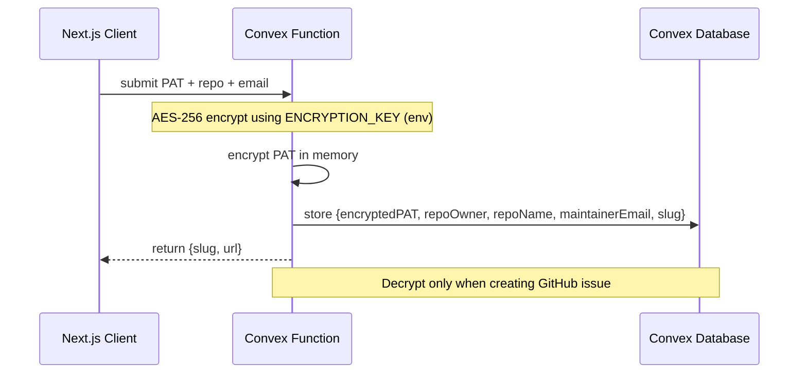

# Koustos MVP – Technical Design Document (TDD)

## 1. Executive Summary
Koustos is a lightweight, serverless micro-service that turns a one-time GitHub-PAT + repo configuration into a public, rate-limited bug-report portal.  
The system is optimized for sub-30-second setup, sub-2-minute reporter flow, and <$0.001 marginal cost per report.

## 2. High-Level Architecture
```mermaid
graph TD
    subgraph Client
        A[Next.js 14 (Vercel)<br/>koustos.dev]
    end
    subgraph Vercel
        B[Vercel Edge/SSR]
    end
    subgraph Convex
        C[Convex Functions<br/>setup / report / ai / finalize]
        G[(Convex Database:<br/>Projects, Reports)]
        H[(Secrets/Env: ENCRYPTION_KEY)]
    end
    subgraph External
        J[GitHub REST v3]
        K[OpenAI API]
        L[Resend API]
    end

    A <--> B
    B <--> C
    C --> K
    C --> J
    C --> L
    C --> G
    G -.-> H
```

## 3. Component Specification

### 3.1 Front-End (Next.js 14 + TypeScript)
- Hosted on Vercel (Preview → Prod via GitHub integration).
- No client-side secrets; calls Convex functions for server actions.
- Styling: TailwindCSS, no emoji font.
- Accessibility: WCAG 2.1 AA.

### 3.2 Convex Functions
- `setup.createProject(pat, repo, email)` → validate PAT via GitHub API, encrypt PAT, store project, return slug/url.
- `report.start(slug, name, email, description)` → create report, enforce rate limit, return first AI question.
- `ai.respond(reportId, answer)` → drive conversation; stop after 2 follow-ups.
- `finalize.submit(reportId, edits?)` → decrypt PAT, create GitHub issue, send emails via Resend.

Rate limit enforced in Convex using per-slug counters (10 reports/hour).

### 3.3 Integrations
- OpenAI via official SDK from Convex functions (system prompt enforces 2 Qs, English-only, no emojis).
- GitHub REST v3 for issue creation (Authorization: token `PAT`).
- Resend for transactional emails.

## 4. Data Model (Convex)

```javascript
projects: {
  slug: string,              // 8-char random
  github_pat_encrypted: string,
  repo_owner: string,
  repo_name: string,
  maintainer_email: string,
  created_at: number
}

reports: {
  project_id: Id<"projects">,
  reporter_name: string,
  reporter_email: string,
  raw_input: string,
  ai_q1?: string,
  ai_a1?: string,
  ai_q2?: string,
  ai_a2?: string,
  formatted_issue?: string,
  github_issue_number?: number,
  created_at: number,
  updated_at?: number
}
```

### 4.3 Encrypted PAT Storage Flow


Decryption is symmetric; key never leaves Convex runtime.

## 5. API Contract (OpenAPI 3.1 snippet)

### POST /setup
Request:
```json
{
  "pat": "ghp_***",
  "repo": "owner/repo",
  "email": "maintainer@example.com"
}
```
Response `201`:
```json
{
  "slug": "a1b2c3d4",
  "url": "https://koustos.dev/f/a1b2c3d4"
}
```
Error `400` – invalid repo format  
Error `403` – PAT lacks `public_repo` scope

### POST /report/{slug}/finalize
Request:
```json
{
  "reportId": "uuid",
  "editMarkdown": "optional diff"
}
```
Response `201`:
```json
{
  "issueUrl": "https://github.com/owner/repo/issues/42"
}
```
Error `429` – rate limit exceeded

## 6. AI Conversation Logic
Prompt template (system):
```
You are a bug triage assistant. Ask concise clarifying questions.
Stop after two questions. Do not greet or thank. Language: English.
```

State machine stored in DynamoDB attribute `aiState`:
- `WAIT_DESC` → `Q1_SENT` → `A1_RECEIVED` → `Q2_SENT` → `A2_RECEIVED` → `READY`

After `READY` the Lambda refuses further AI calls.

## 7. Rate Limiting & Abuse Protection
- Server-side per-slug counter in Convex with a 1-hour fixed window (10 reports/hour).
- Optional CAPTCHA (Turnstile or hCaptcha) on submit; score not stored.

## 8. Error Handling Matrix
| Code | User Message | Logs | Alert |
|------|--------------|------|-------|
| 429 | “Too many reports. Try again later.” | WARN | Slack |
| 502 GH | “GitHub unavailable. Retry in a few minutes.” | ERROR | PagerDuty |
| 500 AI | “AI service error. Refresh to continue.” | ERROR | PagerDuty |
| 400 Email | “Invalid email format.” | INFO | None |

All 5xx responses return `x-request-id` header for support.

## 9. Security Considerations
- PAT encrypted with envelope encryption (KMS CMK rotation yearly).
- Lambda execution role least-privilege: only `dynamodb:GetItem` on Projects, `kms:Decrypt` on PAT key.
- Cloudflare Pages uses HSTS, CSP `default-src 'self'; script-src 'self' 'unsafe-inline'`.
- No cookies; JWT signed with ES256 (public key pinned in Functions).

## 10. Testing Strategy

### 10.1 Unit (Jest + PyTest)
- Encryption/decryption round-trip.
- AI prompt token count ≤ 300.
- Markdown template rendering.

### 10.2 Integration (LocalStack + WireMock)
- Lambda → LocalStack DynamoDB.
- GitHub Proxy → WireMock GitHub API.
- Mailer → Resend sandbox endpoint.

### 10.3 End-to-End (Cypress)
- Setup under 30 s timer assertion.
- Reporter flow under 2 min.
- 11th report blocked.
- Email received within 10 s (MailHog).

### 10.4 Performance (k6)
- 100 concurrent setups → p(90) latency ≤ 30 s.
- 500 reports/min across 50 projects → no 429 unless >10/h per slug.

### 10.5 Chaos (Gremlin)
- Kill Lambda AZ → auto-retry ≤ 3x, still meets N2.
- KMS throttle → circuit breaker open, fallback “GitHub unavailable”.

## 11. Deployment & CI/CD
- GitHub Actions:
  - PR → lint + unit + integration.
  - Merge → deploy to Vercel Preview.
  - Tag `v*` → promote to Vercel Production; Convex deploy as part of pipeline.
- Environment variables managed via Vercel/Convex, rotated periodically.

## 12. Observability
- Logs & metrics: Vercel logs, Convex Observability.
- Dashboards:
  - Setup latency p50/p90/p99
  - Cost per report (OpenAI tokens + Resend)
  - Rate-limit hits per slug
- Alerts (via GitHub Actions + external notifier):
  - p90 setup > 30 s
  - p90 report > 2 min
  - Any 5xx > 1% in 10 min

## 13. Future Extensibility (out of MVP)
- Multi-language support (i18n keys already isolated).
- Optional GitHub issue templates.
- Webhook to mark issue as “triaged”.
- Slack/Discord notifications instead of email.

## 14. Milestone & Deliverables
| Week | Deliverable | Owner |
|------|-------------|--------|
| 1 | Terraform + CI scaffold | DevOps |
| 2 | Setup & encrypt flow | Backend |
| 3 | Reporter form + AI conv | Full-stack |
| 4 | GitHub issue + emails | Backend |
| 5 | Rate-limit + E2E tests | QA |
| 6 | Security audit & pen-test | Security |
| 7 | Beta with 5 pilot repos | PM |

## 15. Sign-Off
| Role | Name | Date |
|------|------|------|
| Architect |      |      |
| PM     |      |      |
| QA Lead |      |      |